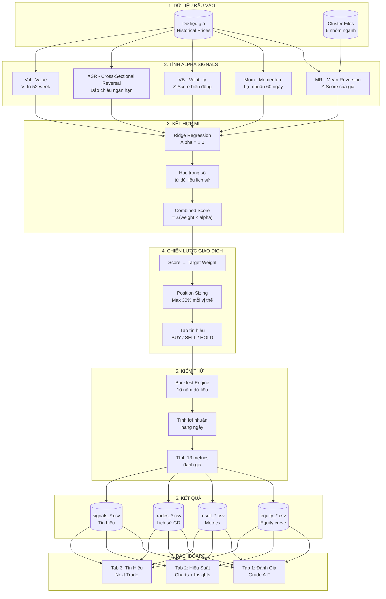
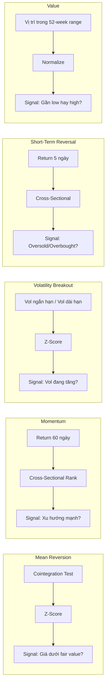
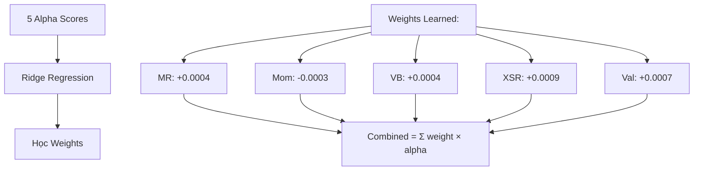
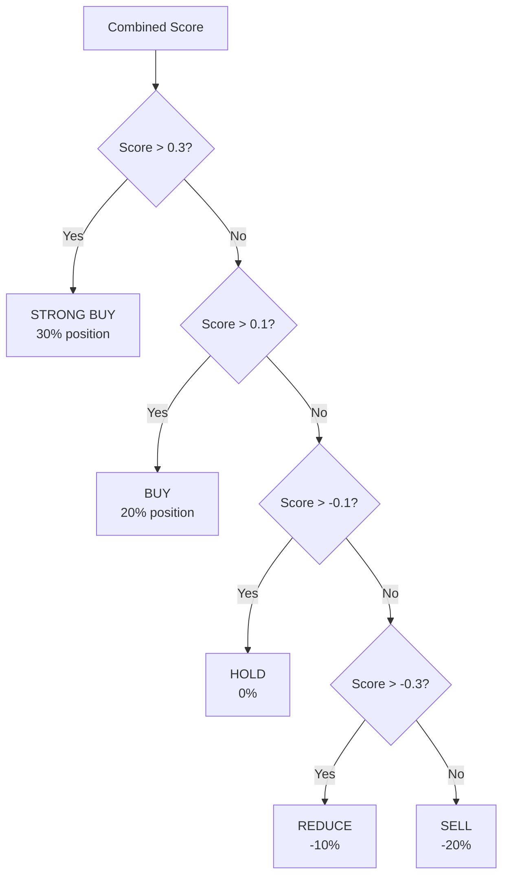
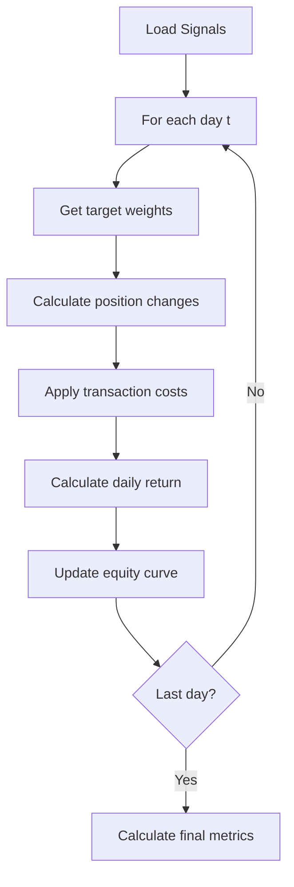
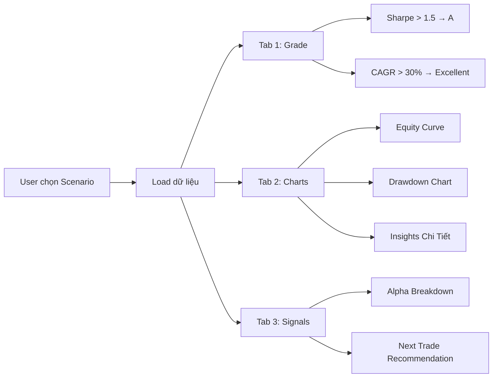
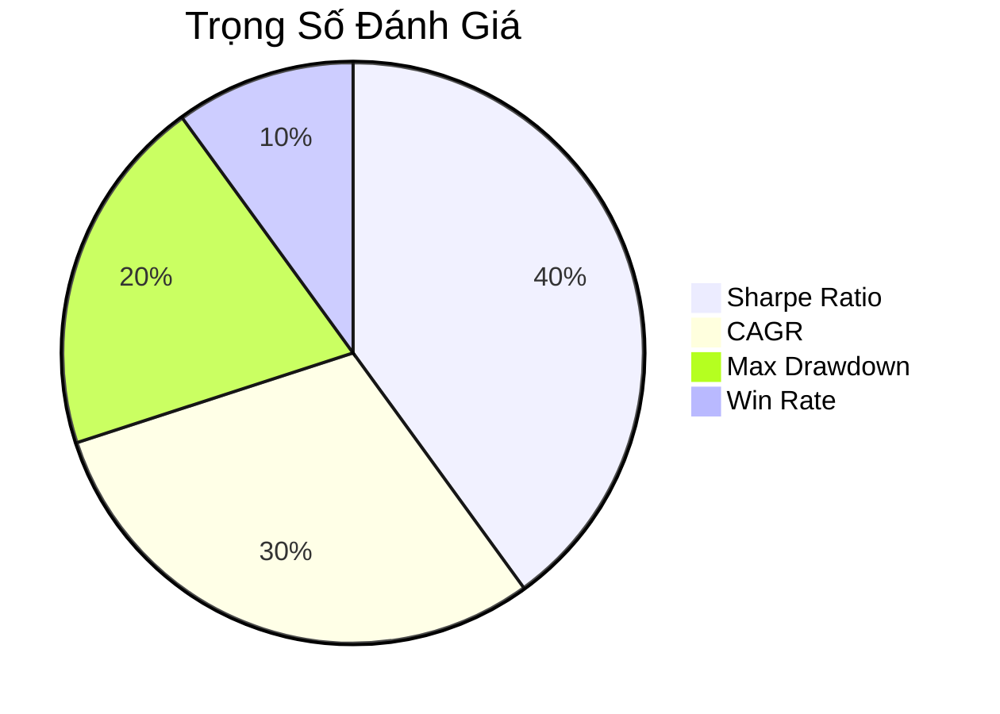

# Multi-Alpha Trading System - Pipeline Diagram

## Sơ Đồ Toàn Bộ Hệ Thống



---

## Chi Tiết Từng Bước

### 1. Dữ Liệu Đầu Vào
```
clusters/
├── cluster_financial-services_banks-regional.csv
├── cluster_technology_software-application.csv
├── cluster_consumer-cyclical_furnishings.csv
├── cluster_healthcare_biotechnology.csv
├── cluster_communication-services_advertising.csv
└── cluster_technology_semiconductors.csv
```

### 2. Tính Alpha Signals



### 3. ML Combination



### 4. Strategy & Position Sizing



### 5. Backtest Engine



### 6. Output Files

| File | Nội dung |
|------|----------|
| `equity_*.csv` | Equity curve theo ngày |
| `result_*.csv` | 13 performance metrics |
| `trades_*.csv` | Chi tiết từng giao dịch |
| `signals_*.csv` | Tín hiệu alpha theo ngày |
| `Final_Report.csv` | Tổng hợp tất cả clusters |

### 7. Dashboard Flow



---

## Metrics Đánh Giá



| Điểm | Grade | Ý Nghĩa |
|------|-------|---------|
| 90-100 | A+ | Xuất sắc |
| 80-89 | A | Tuyệt vời |
| 70-79 | B+ | Rất tốt |
| 60-69 | B | Tốt |
| 50-59 | C | Trung bình |
| < 50 | D | Cần cải thiện |

---

## Kết Quả Tốt Nhất

```
Cluster: Banks Regional
├── Sharpe Ratio: 1.58 (Grade A)
├── CAGR: 55.2%
├── Total Return: 7914%
├── Max Drawdown: -48.6%
└── Win Rate: 53.7%
```

---

*Pipeline hoàn chỉnh từ dữ liệu thô → Alpha signals → ML → Strategy → Backtest → Dashboard*
