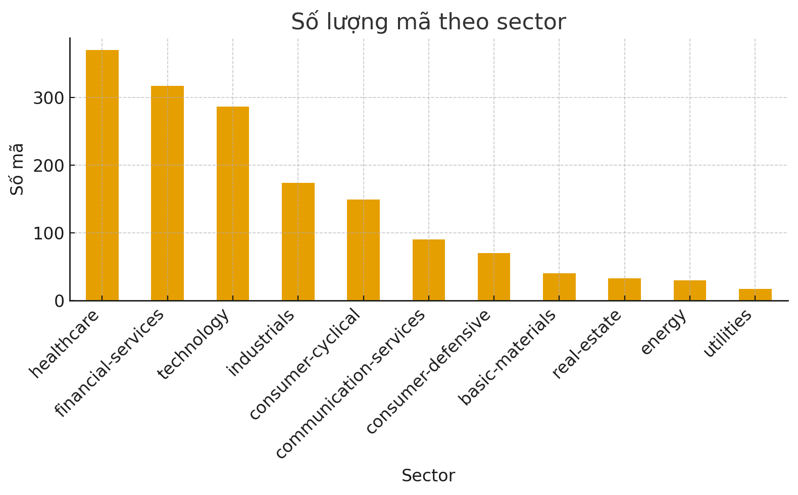
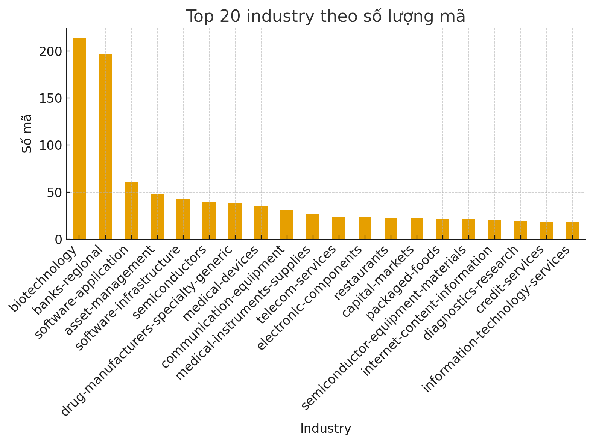

# Ticket Selection
Phần này sẽ làm về cách chọn ticket để sử dụng chiến thuật Pair Trading và các signal khác. 

## 0. Overview

Hiện tại, những tài nguyên đã có:
- Từ ~/labs/week123, nhóm đã có được dữ liệu price-volumn dataset của hơn 1808 ticket trong period 10 năm. 
- Các dạng data khác (Không sử dụng chính trong phần project)

Công việc hiện tại nhóm quyết định: Định nghĩa riêng một mini-sector, để chọn nhiều nhóm cổ phiếu (khoảng 5 nhóm, mỗi nhóm khoảng 10 cổ phiếu) để thực hiện các phân tích sâu hơn.

## 1. Nguyên tắc

Một cụm tốt cho pair trading bao gồm các tiêu chí sau:

### 1.1. Cùng loại business / sector rộng
Không nhất thiết phải đúng 100% GICS, nhưng bản chất phải giống nhau:
- Cùng ngành ngân hàng, big tech, nhà bán lẻ, dầu khí, tiện ích, v.v.
- Ý nghĩa: các cổ phiếu cùng chịu tác động của những yếu tố vĩ mô và sector giống nhau, thuận lợi để khai thác chênh lệch tương đối.

### 1.2. Thống kê giá khá giống nhau

- Return, volatility, beta, drawdown, pattern biến động tương đồng.

- Để nếu có mispricing ngắn hạn, khi bạn long/short trong cụm, spread có cơ hội “mean-revert”.

### 1.3. Đủ thanh khoản và size tương đương

- Không ghép 1 midcap thanh khoản vừa với 1 microcap cạn thanh khoản.

- Trong 1 cụm, cổ phiếu nên có dollar volume cùng “level”.

### 1.4. Có lịch sử correlation/cointegration tương đối cao

- Trong 1 cụm, đa số cặp có correlation dương, tương đối cao trên returns.

- Ít nhất một số cặp có cointegration ổn nếu bạn làm pairs kiểu statistical arbitrage cổ điển.

## 2. Những đặc trưng (features) dùng để định nghĩa cụm

### 2.1. Nhóm đặc trưng “hành vi giá”

Làm trên log-return ngày:

- Mean daily return: trung bình log-return, có thể dùng thêm annualized.

- Volatility: độ lệch chuẩn daily return (annualized).

- Beta với thị trường: Lấy SPY hoặc S&P 500 index làm benchmark, chạy hồi quy để có beta.

- Idiosyncratic volatility: phần residual sau khi trừ beta*market return.

- Skewness, kurtosis (tuỳ chọn): phản ánh phân phối tail.

Ý nghĩa:
Cùng beta, cùng vol ⇒ phản ứng tương tự với market shock.
Idio vol tương tự ⇒ độ “noise” riêng từng mã tương đương.

2.2. Nhóm đặc trưng “thanh khoản và size”

Từ data price–volume:

- Average dollar volume: $avg\_dollar\_vol = mean(close * volume)$ trong 6–12 tháng gần nhất.

- Turnover ratio proxy: Không có số lượng cổ phiếu lưu hành thì khó chính xác, nhưng bạn có thể lấy turnover tương đối bằng cách chuẩn hóa volume/volatility hay volume/price.

Điều kiện lọc:

- Loại bỏ mã có avg dollar volume quá thấp (khó long/short).

- Trong cụm, các mã nên có dollar volume cùng “order of magnitude”.

### 2.3. Nhóm đặc trưng “tương đồng động học”

Đây là phần quan trọng với pair trading:

#### 2.3.1. Rolling correlation matrix

- Lấy return 2–3 năm gần nhất, tính correlation giữa mọi cặp.

- Với mỗi mã, có thể dùng:

    - Correlation trung bình với các mã cùng sector “thô” (theo label yfinance nếu có)

    - Hoặc embedding theo PCA trên ma trận correlation.

#### 2.3.2. Factor / PCA embedding

- Chạy PCA trên ma trận returns (hoặc on covariance matrix).

- Lấy 3–5 principal components đầu làm features.

- Mã nào có vector loading gần nhau ⇒ hành vi giá tương tự theo các yếu tố chung.

#### 2.3.3 Cointegration score 

- Không nhất thiết dùng cho toàn bộ 1808 mã, nhưng có thể: Sau khi đã có cụm thô, test cointegration trong cụm để chọn cặp.

- Trong định nghĩa cụm, chỉ cần đảm bảo: trong cụm, tỷ lệ cặp cointegrated đủ tốt.

## 3. Định nghĩa cụm đề xuất

Một cụm là một tập từ 2 cổ phiếu ${s_1, s_2, ..., s_{n}}$

#### • Điều kiện về ngành
- Các mã thuộc **cùng một sector/industry rộng**  
  (theo GICS, ICB, hoặc label từ *yfinance*).

#### • Điều kiện về đặc tính thống kê
- **Volatility** nằm trong cùng một dải  
  (ví dụ cùng một **decile** trong toàn universe).
- **Beta với SPY** không chênh lệch quá một ngưỡng  
  (ví dụ: `|βᵢ − βⱼ| < 0.2`).
- **Bình quân pairwise correlation** của daily returns (2–3 năm gần nhất) trong cụm **> 0.5**.
- **Average dollar volume** của các mã không chênh nhau quá lớn  
  (tỷ lệ `max/min < 5`).

#### • Điều kiện về cointegration 
- Trong cụm tồn tại ít nhất vài cặp `(i, j)` có **p-value cointegration test < 0.05**.

---

### Như vậy “cụm” được đặc trưng bởi:
- **Giống nhau về economic exposure** (sector)  
- **Giống nhau về hành vi thống kê** (beta, volatility, factor loading)  
- **Có background correlation cao**  
- **Thanh khoản hợp lý**

Mình viết lại toàn bộ **phần 4** cho “đầy” và song song rõ ràng với phần 3 nhé. Bạn có thể copy nguyên block này dán vào report.

---

## 4. Quá trình thực hiện

Phần này mô tả chi tiết cách triển khai toàn bộ pipeline tương ứng với các điều kiện trong Mục 3:

* Điều kiện về ngành
* Điều kiện về đặc tính thống kê
* Điều kiện về cointegration

Toàn bộ pipeline được xây dựng trên dữ liệu price volume 10 năm lấy từ bộ dữ liệu yfinance trên Kaggle, kết hợp với thông tin sector/industry lấy từ Yahoo.

---

### 4.1. Lấy thông tin sector/industry của cổ phiếu

**Mục tiêu:** gán cho mỗi mã cổ phiếu một cặp nhãn `(sectorKey, industryKey)` để có thể lọc theo điều kiện ngành trong Mục 3.

**Cách làm:**

* Lấy danh sách toàn bộ ticker từ thư mục `per_symbol` trên Kaggle:
  `yfinance/per_symbol/*.csv`.
* Sử dụng thư viện `yahooquery` với endpoint `asset_profile` để lấy thông tin:

  * `sectorKey`
  * `industryKey`

**Notebook:**
`notebooks/retrieve_sector_industry.ipynb`

**Output:**
Bảng ánh xạ
`dataset/sector_industry.csv` với cấu trúc:

* `ticker`
* `sectorKey`
* `industryKey`

**Visualization:**

* Phân bố số lượng mã theo sector:

  

* Top 20 industry theo số lượng mã:

  

**Nhận xét:**

* Sector phân bố khá rộng:

  * healthcare: ~ 370
  * financial-services: ~ 317
  * technology: ~ 287
  * industrials: ~ 174
  * consumer-cyclical: ~ 149
* Industry cũng được phân mảnh chi tiết:

  * biotechnology: ~ 214
  * banks-regional: ~ 197
  * software-application, asset-management, semiconductors, medical-devices, v.v.

Để minh họa pipeline, nhóm quyết định tập trung vào tập:

* `sectorKey = healthcare`
* `industryKey = biotechnology`

Chi tiết ticker được lưu tại:
`dataset/biotech_healthcare_tickers.csv`.

---

### 4.2. Volatility Calculation

Phần này tương ứng điều kiện:

> Volatility nằm trong cùng một dải (ví dụ cùng một decile trong toàn universe).

#### 4.2.1. Định nghĩa volatility

* Sử dụng **log return ngày** trên giá đóng cửa `Close` (xem như tương đương `Adj Close` trong dataset).
* Xét **252 phiên gần nhất** cho mỗi mã (xấp xỉ 1 năm giao dịch).
* Volatility 1 năm được định nghĩa:

$$
\sigma_{\text{1y}} = \text{std}(\text{daily log return}) \times \sqrt{252}
$$

Trong đó:

* `daily log return = log(Close_t) - log(Close_{t-1})`
* `std` là độ lệch chuẩn mẫu của chuỗi log return trong 252 phiên.

#### 4.2.2. Quy trình tính volatility cho toàn universe

1. Duyệt qua toàn bộ ticker có file giá trong thư mục `yfinance/per_symbol`.
2. Với từng ticker:

   * Đọc dữ liệu, xử lý các header noise (các dòng đầu chứa tên ticker, non numeric).
   * Chuẩn hóa cột `Date` về kiểu `datetime`, sort theo thời gian.
   * Lấy 252 quan sát gần nhất, tính log return ngày.
   * Nếu số lượng quan sát hợp lệ < ngưỡng `min_obs` (ví dụ 200) thì bỏ qua mã.
   * Tính `σ_1y` theo công thức trên.
3. Lưu kết quả thành bảng:

   * `ticker`
   * `vol_1y`
   * `vol_decile`

   Trong đó `vol_decile` được gán bằng `pd.qcut(vol_1y, 10)` trên toàn universe, nghĩa là chia toàn bộ cổ phiếu thành 10 dải volatility từ thấp đến cao.

#### 4.2.3. Lọc theo volatility decile

* Đầu tiên, áp dụng trên **toàn bộ universe** để mỗi mã được gán một decile volatility.
* Sau đó, khi filter một sector/industry cụ thể (ví dụ biotech):

  * Merge `biotech_healthcare_tickers.csv` với bảng volatility.
  * Lọc những mã nằm trong các decile được chọn, ví dụ:

    * `vol_decile ∈ {4, 5, 6}` để chọn nhóm volatility trung bình.
  * Kết quả là tập `biotech_mid_vol` dùng cho bước beta.

---

### 4.3. Beta vs SPY

Phần này tương ứng điều kiện:

> Beta với SPY không chênh lệch quá một ngưỡng (ví dụ: `|βᵢ − βⱼ| < 0.2`).

#### 4.3.1. Định nghĩa beta

Beta phản ánh mức độ nhạy của một cổ phiếu trước biến động của "thị trường chung".

Công thức cơ bản:

$$
\beta_i = \frac{\text{Cov}(r_i, r_m)}{\text{Var}(r_m)}
$$

Trong đó:

* (r_i): return ngày của cổ phiếu i
* (r_m): return ngày của chỉ số thị trường (market factor)

Ý nghĩa:

* Beta đo mức độ và chiều phản ứng của cổ phiếu so với thị trường.
* Ví dụ:

  * Nếu thị trường tăng 1% và cổ phiếu thường tăng khoảng 1.5% thì beta > 1.
  * Nếu cổ phiếu ít biến động hơn thị trường thì beta < 1.

Nhóm sử dụng **SPY** để đại diện cho thị trường:

* SPY = SPDR S&P 500 ETF Trust
* ETF mô phỏng chỉ số S&P 500, đại diện cho 500 công ty lớn nhất nước Mĩ theo vốn hóa.

#### 4.3.2. Tính return của SPY

* Dùng file `SPY.csv` riêng, cũng được làm sạch header noise tương tự các mã khác.
* Lấy khoảng thời gian tương thích với giai đoạn volatility (khoảng 1 năm gần nhất hoặc dài hơn).
* Tính log return ngày:

$$
r_m(t) = \log(\text{Close}*{m,t}) - \log(\text{Close}*{m, t-1})
$$

* Lưu vào bảng `spy_ret` với cột:

  * `Date`
  * `r_m`

#### 4.3.3. Tính beta cho từng mã

Với mỗi cổ phiếu i:

1. Load chuỗi giá sạch, align với khoảng thời gian của `spy_ret` theo `Date`.
2. Tính log return ngày `r_i`.
3. Merge với `spy_ret` theo ngày, giữ những phiên chung, bỏ NaN.
4. Nếu số quan sát < `BETA_MIN_OBS` (ví dụ 200) thì bỏ mã.
5. Tính:

$$
\beta_i = \frac{\text{Cov}(r_i, r_m)}{\text{Var}(r_m)}
$$

* Kết quả lưu vào bảng:

  * `ticker`
  * `beta_spy`

#### 4.3.4. Lọc theo beta band

* Trên tập đã lọc theo volatility (ví dụ `biotech_mid_vol`), merge thêm `beta_spy`.
* Tính median beta của nhóm:

$$
\beta_{\text{center}} = \text{median}(\beta_i)
$$

* Giữ những mã thỏa:

$$
\left|\beta_i - \beta_{\text{center}}\right| \le \text{BETA\_TOL}
$$

Ví dụ với `BETA_TOL = 0.2`.

* Kết quả là tập `biotech_vol_beta_filtered` dùng cho bước tiếp theo (correlation, dollar volume, cointegration).

---

### 4.4. Pairwise correlation và average dollar volume

Phần này tương ứng hai điều kiện:

* Bình quân pairwise correlation của daily returns (2 đến 3 năm gần nhất) trong cụm > 0.5.
* Average dollar volume của các mã không chênh nhau quá lớn (tỷ lệ `max/min < 5`).

#### 4.4.1. Xây dựng ma trận return chung

Trên tập mã đã qua bước volatility và beta (ví dụ `biotech_vol_beta_filtered`):

1. Load dữ liệu OHLCV sạch cho tất cả ticker trong nhóm.
2. Tìm khoảng thời gian giao nhau lớn nhất giữa các mã:

   * Lấy `latest_start` là ngày bắt đầu muộn nhất.
   * Lấy `earliest_end` là ngày kết thúc sớm nhất.
   * Giới hạn thêm trong 2 đến 3 năm gần nhất bằng:

     * `range_start = max(latest_start, earliest_end - 3 năm)`
     * `range_end = earliest_end`.
3. Với mỗi mã:

   * Lọc dữ liệu trong `[range_start, range_end]`.
   * Tính log return ngày `r_i`.
   * Drop NaN, chuẩn hóa thành bảng `(Date, ticker_i_return)`.
4. Merge tất cả các series return theo `Date` để tạo ma trận:

$$
\text{df\_returns} \in \mathbb{R}^{T \times (1 + N)}
$$

* Cột đầu là `Date`, các cột còn lại là return theo từng ticker.

#### 4.4.2. Tính average pairwise correlation

* Bỏ cột `Date`, lấy ma trận return `ret_mat` kích thước `T x N`.
* Dùng `ret_mat.corr()` để lấy ma trận tương quan `N x N`.
* Average pairwise correlation được tính:

  * Bỏ đường chéo (corr với chính nó).
  * Lấy trung bình các phần tử còn lại.

Nếu:

$$
\text{avg pairwise corr} > 0.5
$$

thì nhóm mã được xem là có nền tảng biến động chung đủ mạnh, phù hợp với yêu cầu của cụm trong Mục 3.

#### 4.4.3. Tính average dollar volume và kiểm tra size

Để đảm bảo thanh khoản tương đồng:

1. Trên cùng khoảng thời gian `[range_start, range_end]`, với mỗi ticker:

   * Tính `dollar_vol_t = Close_t × Volume_t`.
   * Lấy trung bình theo thời gian:
     $\overline{DV}_i = \text{mean}(dollar_vol_t)$.

2. Xây bảng:

   * `ticker`
   * `avg_dollar_vol`

3. Tính:

$$
\text{ratio} = \frac{\max_i \overline{DV}_i}{\min_i \overline{DV}_i}
$$

* Nếu `ratio < 5`: nhóm này thỏa điều kiện về thanh khoản (không có mã quá nhỏ hoặc quá lớn một cách cực đoan trong cụm).
* Nếu `ratio` quá lớn:

  * Áp dụng một band quanh median:

$$
\text{lower} = 0.5 \times \text{median}(\overline{DV}_i), \quad
\text{upper} = 2.0 \times \text{median}(\overline{DV}_i)
$$

* Lọc giữ những mã có `avg_dollar_vol` nằm trong `[lower, upper]`.
* Trên tập này, lại tính ma trận correlation và chọn ra tối đa `K` mã có mean correlation cao nhất để tạo cụm.

---

### 4.5. Kiểm tra cointegration trong cụm

Phần này tương ứng điều kiện:

> Trong cụm tồn tại ít nhất vài cặp `(i, j)` có p-value cointegration test < 0.05.

Nhóm sử dụng kiểm định Engle Granger (EG test) để đánh giá cointegration giữa các cặp cổ phiếu trên log price.

#### 4.5.1. Chuẩn bị dữ liệu cho cointegration

Trên cụm nhỏ đã được chọn sau bước correlation và dollar volume (ví dụ 7 mã):

1. Build dataset dạng long:

   * `Date`
   * `ticker`
   * `Close`
   * `Volume`
   * (có thể giữ thêm `Open`, `High`, `Low`)

2. Giới hạn dữ liệu trong khoảng `COINT_LOOKBACK_YEARS` (ví dụ 3 năm gần nhất).

#### 4.5.2. Engle Granger cointegration test

Với mỗi cặp `(i, j)` trong cụm:

1. Lấy log price:

$$
y_i(t) = \log(\text{Close}_i(t)), \quad
y_j(t) = \log(\text{Close}_j(t))
$$

2. Thực hiện Engle Granger test (ví dụ bằng `statsmodels.tsa.stattools.coint`):

   * Hồi quy tuyến tính một chuỗi theo chuỗi còn lại.
   * Kiểm định tính dừng của residual.

3. Thu về p-value cho giả thuyết:

   * H0: không cointegrated.
   * H1: có cointegration.

4. Nếu `p-value < 0.05`, cặp `(i, j)` được coi là **cointegrated**.

#### 4.5.3. Lựa chọn mã cuối cùng trong cụm

* Thu tất cả cặp có `p-value < 0.05`.
* Tập mã cuối cùng trong cụm được định nghĩa là:

$$
S_{\text{final}} = {, s \mid s \text{ xuất hiện trong ít nhất một cặp cointegrated },}
$$

* Trên tập `S_final`, ta giữ lại toàn bộ chuỗi OHLCV và xuất ra file `.csv` cuối cùng cho cụm, dùng làm input cho xây dựng chiến lược pair trading (spread, backtest, chiến lược vào lệnh).
